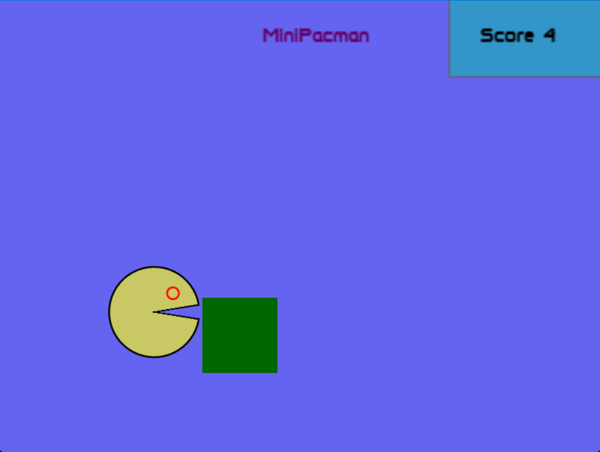
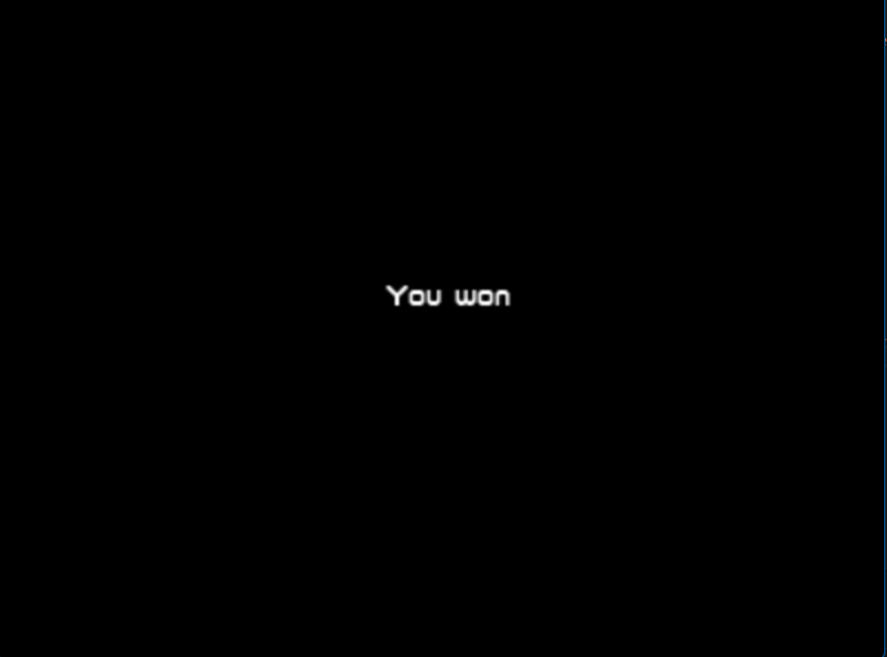

# MiniPacman

MiniPacman is a simple 2d game inspired from the pacman game.

## Goal

Goal of this game is to get high score by picking up the food (shown / drawn as green rectangle in [screenshot](#game))

## TechStack

Lua based love2d game library is used to build this game. Love2d is game library which is based on frame by frame updating. 

## Functionalities
(**Note** Some functionalities can't be seen in the picture becoz those are based on animation and some may be trivial but for frame by frame updating, those are little involved)

1. Pacman object can be moved in all four directions (up,down, right, left) using keys `W`,`S`,`D`,`A`.
2. Pacman mouth has open/close animation
3. Food item can be picked by colliding/overlapping with it.
4. All food items appearing on the screen contains same score 1.
5. Pacman can't leave the bounds of the game screen.
6. You win the game when you get high score (by default , it is 5)

## Limitations

1. Due to frame by frame drawing, calculating collison is difficult for complex shapes. So i opt for rectangle for food item.
2. Frame is not resizable due to static drawing positions in game screen.

## ScreenShots : 

### Game

### Win!

